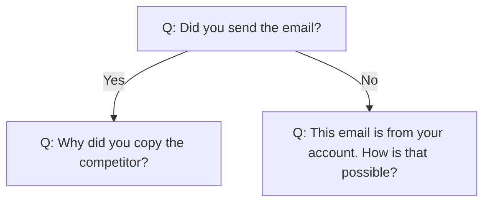
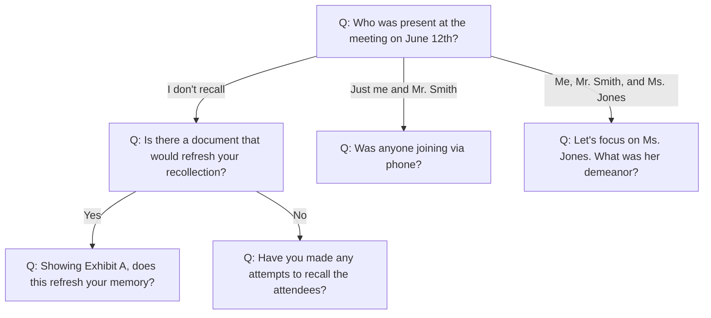

# markdown-decision-tree
A Decision Tree format for humans exportable to visualisers like Mermaid, Ink, etc.

[](https://www.typescriptlang.org/)
[](LICENSE)

A formally specified Markdown subset for representing conditional question trees. Designed for witness preparation, legal depositions, interview planning, and interactive branching dialogue systems.

## Quick Start

### Installation

```bash
npm install markdown-decision-tree
```

### Basic Usage

```typescript
import { toMermaid, toInk } from 'markdown-decision-tree';

const markdown = `
# Cross Examination

- **Q:** Did you send the email?
  - **IF:** "Yes"
    - **Q:** Why did you copy the competitor?
  - **IF:** "No"
    - **Q:** This email is from your account. How is that possible?
`;

// Convert to Mermaid for visualization
const mermaidGraph = toMermaid(markdown);
console.log(mermaidGraph);

// Convert to Ink for interactive practice
const inkScript = toInk(markdown);
console.log(inkScript);
```

---

## Table of Contents

- [Overview](#overview)
- [Design Principles](#design-principles)
- [Lexical Elements](#lexical-elements)
- [Node Types](#node-types)
- [Indentation & Nesting](#indentation--nesting)
- [Structural Rules](#structural-rules)
- [Conversion Examples](#conversion-examples)
- [Error Handling](#error-handling)
- [Formal Grammar](#formal-grammar)
- [Use Cases](#use-cases)
- [API Reference](#api-reference)

---

## Overview

**Markdown Decision Tree (MDT)** is a constrained Markdown dialect designed to represent branching conditional logic in a human-readable, machine-parseable format.

### Intended For

- **Legal witness preparation**: Structure cross-examination question paths with anticipated responses
- **Interview planning**: Map conditional follow-up questions based on interviewee answers
- **Interactive fiction/games**: Represent branching dialogue trees for games and chatbots
- **Diagnostic flowcharts**: Encode decision processes for troubleshooting or decision support

### Key Features

- ✅ **Human-readable**: Plain text, scannable at a glance
- ✅ **Machine-parseable**: Deterministic structure, no ambiguity
- ✅ **Convertible**: Translate to Mermaid (visualization), Ink (interactive), JSON (data)
- ✅ **Version-controllable**: Git-friendly, mergeable
- ✅ **Minimal syntax**: Only four constructs; easy to learn

---

## Design Principles

1. **Scanability**: Keywords (`**Q:**`, `**IF:**`) are bolded for instant recognition during high-pressure situations
2. **Minimalism**: Only essential Markdown constructs; all others forbidden
3. **Determinism**: Parse-once, deterministic node ID assignment
4. **Convertibility**: Lossless translation to Mermaid, Ink, and other tree formats
5. **Auditability**: Plain text enables version control and diff-based review

---

## Lexical Elements

MDT allows **only** the following Markdown constructs. All other Markdown features are **forbidden**.

### ATX Headings

```markdown
# Main Topic
## Subtopic
### Deep Subtopic
```

**Rules:**
- Must start at column 0 (no indentation)
- One to six `#` characters, followed by exactly one space
- Followed by heading text (any characters except newline)

**Semantics:** Headings serve as **section markers** that group all subsequent Q-nodes until the next heading of equal or higher level. Questions belong to the most recent preceding heading. This grouping is preserved in output formats and the AST.

### Unordered List Items

```markdown
- Top-level item
  - Nested one level
    - Nested two levels
```

**Rules:**
- Indent must be zero or more spaces (tabs **forbidden**)
- Exactly one hyphen `-` followed by exactly one space
- Followed by content (any characters except newline)

**Semantics:** Lists are the primary structure for Q-nodes and IF-nodes. Indentation depth determines nesting hierarchy.

### Bold Markers

**Only two bold markers are allowed:**

- `**Q:**` – Question marker
- `**IF:**` – Condition marker

**Rules:**
- Exactly two asterisks before and after text
- Only allowed at the start of list item content
- No other bold text is permitted

**Valid:**
```markdown
- **Q:** This is allowed
- **IF:** This is also allowed
```

**Invalid:**
```markdown
- **Other:** This is forbidden
- Text with **bold** inside is forbidden
```

### Plain Text

**Allowed:** Any UTF-8 text that does not contain the `**` sequence.

**Forbidden:** Code blocks, tables, links, emphasis, strikethrough, or any other Markdown formatting.

### Text Content Restrictions

**Forbidden in Q-node and IF-node text:**
- The sequence `**` (double asterisk) - cannot appear in text
- Tab characters (U+0009)
- Newline characters (text must be single-line)

**No escape mechanism:** If your question or answer text requires literal `**`, rephrase to avoid it. There is no escape sequence.

**Case sensitivity:** Markers `**Q:**` and `**IF:**` are case-sensitive. `**q:**`, `**if:**`, `**Q :**`, `** Q:**` are all invalid.

**Whitespace in markers:** The markers must be exactly `**Q:**` and `**IF:**` with no internal whitespace variations.

---

## Node Types

### Question Node (Q-node)

```markdown
- **Q:** Who was present at the meeting on June 12th?
```

**Semantics:**
- Represents a single question to be asked
- Can have zero or more child IF-nodes (branches)
- Each Q-node receives a unique sequential ID: `Q1`, `Q2`, `Q3`, …
- IDs are assigned in **pre-order depth-first traversal**: parent Q-node receives ID before its descendant Q-nodes, and siblings are processed left-to-right in document order

### Branch Condition Node (IF-node)

```markdown
  - **IF:** "I don't recall"
  - **IF:** "Just me and Mr. Smith"
  - **IF:** "Me, Mr. Smith, and Ms. Jones"
```

**Semantics:**
- Represents an expected answer or branch condition
- Serves as a branch point; multiple IF-nodes under a Q-node create multiple branches
- Do **not** receive IDs; they are containers for child Q-nodes
- Answer text becomes an edge label (Mermaid) or choice label (Ink)

### Topic Node (Section Header)

```markdown
# Topic: The June 12th Meeting
- **Q:** Who was present?
```

**Semantics:**
- Groups all subsequent Q-nodes until the next heading of equal or higher level
- A Q-node without a preceding heading belongs to an implicit "root" section
- Heading levels (1-6) establish hierarchy: `#` contains `##`, which contains `###`, etc.
- Preserved in AST as `TopicNode.questions` containing the grouped questions

---

## Indentation & Nesting

### Indent Levels

Indentation is defined by the number of leading spaces before the `-` marker.

**Rules:**
- Base level (top-level Q-nodes): **0 spaces**
- Each nesting level: **exactly 2 additional spaces**
- Tabs are **strictly forbidden**

**Valid indents:**
```markdown
- **Q:** Level 0 (0 spaces)
  - **IF:** Level 1 (2 spaces)
    - **Q:** Level 2 (4 spaces)
      - **IF:** Level 3 (6 spaces)
```

**Invalid indents:**
```markdown
 - **Q:** 1 space – ERROR
   - **IF:** 3 spaces – ERROR
     - **Q:** 5 spaces – ERROR
	- **IF:** TAB – ERROR
```

### Parent-Child Relationships

**Q-node children:** A Q-node at indent level N may have child IF-nodes at level N+1 (N+2 spaces).

**IF-node children:** An IF-node may only have Q-node children at indent level N+1. IF-nodes cannot have other IF-nodes as direct children.

**Sibling nodes:** Nodes at the same indent level under the same parent form a sibling group, processed left-to-right in document order.

---

## Structural Rules

### Valid Document Structure

A valid MDT document:

1. May start with zero or more heading lines (topic sections)
2. Contains one or more Q-nodes (at indent level 0 or under topics)
3. May contain blank lines (for readability). Blank lines are permitted:
   - Between any two node lines
   - Before or after headings
   - At the start of the document (after any leading newlines)
   - Blank lines do **not** interrupt parent-child relationships
   - Consecutive blank lines are normalized to a single blank line
   - A blank line is defined as a line containing only whitespace (spaces) or nothing before the newline
4. Must end with exactly one newline character. Missing final newline is a parse error: `Document must end with newline character`

**Minimal valid document:**
```markdown
- **Q:** First question?
```

### Valid List Items

Every list item (`- ` prefix) must be one of:

1. A Q-node: `- **Q:** <text>`
2. An IF-node: `- **IF:** <text>`

Any other list item form is invalid.

### IF-node Positioning

An IF-node **must** be a child of a Q-node. It cannot:
- Be at the top level (indent 0)
- Appear outside a Q-node hierarchy

**Invalid:**
```markdown
- **IF:** This is invalid at top level
```

**Valid:**
```markdown
- **Q:** Parent
  - **IF:** This is valid as child
```

### Q-node Children

A Q-node may only have IF-node children. Q-nodes cannot directly contain other Q-nodes.

**Invalid:**
```markdown
- **Q:** First question?
  - **Q:** Second question?
```

**Valid:**
```markdown
- **Q:** First question?
  - **IF:** "Some answer"
    - **Q:** Second question?
```

### Empty Nodes

A Q-node or IF-node **must** have non-empty text after the bold marker.

**Invalid:**
```markdown
- **Q:**
- **IF:**
```

**Valid:**
```markdown
- **Q:** This has text
- **IF:** This also has text
```

---

## Conversion Examples

### Example 1: Minimal Question

**Input (Markdown):**
```markdown
- **Q:** What is your name?
```

**Mermaid output:**


**Ink output:**
```ink
Q: What is your name?
```

### Example 2: Simple Branching

**Input (Markdown):**
```markdown
# Cross Examination

- **Q:** Did you send the email?
  - **IF:** "Yes"
    - **Q:** Why did you copy the competitor?
  - **IF:** "No"
    - **Q:** This email is from your account. How is that possible?
```

**Mermaid output:**


**Ink output:**
```ink
Q: Did you send the email?

+ "Yes"
    Q: Why did you copy the competitor?

+ "No"
    Q: This email is from your account. How is that possible?
```

### Example 3: Complex Nested Branching

**Input (Markdown):**
```markdown
# Witness Testimony

- **Q:** Who was present at the meeting on June 12th?
  - **IF:** "I don't recall"
    - **Q:** Is there a document that would refresh your recollection?
      - **IF:** "Yes"
        - **Q:** Showing Exhibit A, does this refresh your memory?
      - **IF:** "No"
        - **Q:** Have you made any attempts to recall the attendees?
  - **IF:** "Just me and Mr. Smith"
    - **Q:** Was anyone joining via phone?
  - **IF:** "Me, Mr. Smith, and Ms. Jones"
    - **Q:** Let's focus on Ms. Jones. What was her demeanor?
```

**Node ID assignment (depth-first order):**
- Q1: "Who was present at the meeting on June 12th?"
- Q2: "Is there a document that would refresh your recollection?"
- Q3: "Showing Exhibit A, does this refresh your memory?"
- Q4: "Have you made any attempts to recall the attendees?"
- Q5: "Was anyone joining via phone?"
- Q6: "Let's focus on Ms. Jones. What was her demeanor?"

**Mermaid output:**


---

## Error Handling

### Parse Errors

The following conditions raise a `ParseError`:

| Condition | Error Message |
|-----------|---------------|
| Empty document (no Q-nodes) | `Document must contain at least one Q-node` |
| Document missing final newline | `Document must end with newline character` |
| Tab character found | `Tabs are not allowed; use spaces only (line N)` |
| Invalid indent | `Indent must be multiple of 2 spaces (line N, got M spaces)` |
| List item without **Q:** or **IF:** | `List item must start with **Q:** or **IF:** (line N)` |
| **Q:** or **IF:** without text | `**Q:**/**IF:** marker requires non-empty text (line N)` |
| IF-node at top level | `**IF:** node cannot appear at indent level 0 (line N)` |
| Q-node as child of Q-node | `Q-node cannot be direct child of another Q-node (line N)` |
| Bold marker not at start | `Bold marker must appear at start of list item content (line N)` |
| Unknown bold marker | `Unknown bold marker (line N, got: **<marker>:**)` |
| Unbalanced bold markers | `Unbalanced bold markers in text (line N)` |
| Invalid marker case | `Markers must be exactly **Q:** or **IF:** (case-sensitive) (line N)` |

### Warnings

Implementations may warn (non-fatal) on:

- Unused headings (topic with no Q-nodes beneath)
- Deeply nested structures (>10 levels)
- Very long answer text (>500 characters)

---

## Formal Grammar

### EBNF Syntax

```ebnf
(* Document structure *)
Document         = { Section } EOF
Section          = [ Heading ] { BlankLine } QuestionList
QuestionList     = QuestionNode { BlankLine | QuestionNode }

(* Nodes - indent level tracked as context *)
QuestionNode     = Indent(N) "- **Q:** " NonEmptyText NEWLINE { IfBranch(N+1) }
IfBranch         = Indent(N) "- **IF:** " NonEmptyText NEWLINE { QuestionNode(N+1) }

(* Headings *)
Heading          = HeadingLevel SP NonEmptyText NEWLINE
HeadingLevel     = "#" | "##" | "###" | "####" | "#####" | "######"

(* Indentation: exactly level * 2 spaces *)
Indent(N)        = SP{N*2}    (* exactly N*2 space characters *)
SP               = " "        (* single space, U+0020 *)

(* Text requirements *)
NonEmptyText     = TextChar { TextChar }
TextChar         = ? any UTF-8 character except NEWLINE, TAB, or "**" sequence ?

(* Whitespace *)
BlankLine        = { SP } NEWLINE
NEWLINE          = "\n"       (* U+000A only; \r\n normalized to \n before parsing *)
EOF              = ? end of input, must be preceded by NEWLINE ?
```

### Indent Constraint

A node at indent level N must have exactly `N * 2` leading spaces. Level 0 has 0 spaces, level 1 has 2 spaces, level 2 has 4 spaces, etc. Any other spacing is a parse error.

### Structural Constraints

- A Q-node may only have IF-node children
- An IF-node may only have Q-node children
- IF-nodes cannot appear at indent level 0 (top level)
- All sibling nodes under the same parent must have identical indent levels

---

## Use Cases

### Legal Witness Preparation

Structure cross-examination questions with anticipated responses. Keep the Markdown file open during deposition for rapid navigation between branches.

```markdown
# Cross-Exam: The June 12th Meeting

- **Q:** Who was present?
  - **IF:** "I don't recall"
    - **Q:** Is there documentation to refresh your memory?
  - **IF:** "Just me and Mr. Smith"
    - **Q:** Why was Ms. Jones excluded?
```

### Interview Planning

Map conditional follow-up questions based on interviewee responses, enabling adaptive interviewing.

### Interactive Fiction & Chatbots

Author branching dialogue trees for games or conversational AI systems using a simple text format.

### Diagnostic Systems

Encode decision logic for medical, technical, or procedural troubleshooting workflows.

---

## API Reference

### `toMermaid(markdownText: string): string`

Converts MDT Markdown to Mermaid graph syntax.

**Parameters:**
- `markdownText` (string): Raw MDT Markdown

**Returns:** Mermaid `graph TD` syntax (string)

**Throws:** `ParseError` on invalid input

**Example:**
```typescript
const markdown = `- **Q:** Question?`;
const mermaid = toMermaid(markdown);
console.log(mermaid);
// Output: graph TD
//     Q1["Q: Question?"]
```

### `toInk(markdownText: string): string`

Converts MDT Markdown to Ink choice script syntax.

**Parameters:**
- `markdownText` (string): Raw MDT Markdown

**Returns:** Ink narration + choice syntax (string)

**Throws:** `ParseError` on invalid input

**Example:**
```typescript
const markdown = `
- **Q:** Yes or no?
  - **IF:** "Yes"
    - **Q:** Why?
  - **IF:** "No"
    - **Q:** Why not?
`;
const ink = toInk(markdown);
console.log(ink);
// Output: Q: Yes or no?
//
// + "Yes"
//     Q: Why?
//
// + "No"
//     Q: Why not?
```

### `parse(markdownText: string): MDTDocument`

Parses MDT Markdown into an internal Abstract Syntax Tree (AST).

**Parameters:**
- `markdownText` (string): Raw MDT Markdown

**Returns:** `MDTDocument` AST object

**Throws:** `ParseError` on invalid input

---

## Type Definitions

```typescript
interface MDTDocument {
  rootQuestions: QuestionNode[];  // Q-nodes with no preceding heading
  topics: TopicNode[];            // Top-level topics (# headings)
}

type MDTNode = QuestionNode | IfNode;

interface QuestionNode {
  type: 'question';
  id: string;          // e.g., "Q1", "Q2"
  text: string;
  children: IfNode[];  // Q-nodes can only have IF-node children
  lineNumber: number;
}

interface IfNode {
  type: 'if';
  answer: string;      // e.g., '"I don\'t recall"'
  children: QuestionNode[];  // IF-nodes can only have Q-node children
  lineNumber: number;
}

interface TopicNode {
  type: 'topic';
  level: number;              // 1-6 corresponding to # through ######
  title: string;
  children: TopicNode[];      // Nested sub-topics of lower level
  questions: QuestionNode[];  // Q-nodes directly under this topic
  lineNumber: number;
}

class ParseError extends Error {
  lineNumber: number;
  constructor(message: string, lineNumber: number);
}
```

---

## Development

### Setup

```bash
git clone <repository>
cd decision-script-converter
npm install
```

### Testing

```bash
# Run all tests
npm test

# Run unit tests
npm run test:unit

# Run integration tests
npm run test:integration

# Watch mode
npm run test:watch

# Coverage report
npm run test:coverage
```

### Build

```bash
npm run build
```

### Linting

```bash
npm run lint
npm run lint:fix
```

---

## Project Structure

```
decision-script-converter/
├── src/
│   ├── types.ts                 # TypeScript interfaces
│   ├── parser.ts                # Markdown parser
│   ├── converters.ts            # toMermaid() and toInk() functions
│   └── index.ts                 # Public API exports
├── tests/
│   ├── converters.unit.test.ts  # Unit tests
│   ├── converters.integration.test.ts  # Integration tests
│   └── fixtures/
│       ├── simple.md            # Minimal example
│       ├── branching.md         # Simple branching
│       └── complex.md           # Nested branching
├── package.json
├── tsconfig.json
├── vitest.config.ts
└── README.md
```

---

## Examples

See the `/tests/fixtures/` directory for complete example files:

- `simple.md` – Minimal single-question document
- `branching.md` – Simple two-level branching
- `complex.md` – Multi-level nested branching with multiple topics

---

## License

MIT

---

## Contributing

Contributions welcome! Please:

1. Fork the repository
2. Create a feature branch (`git checkout -b feature/my-feature`)
3. Add tests for any new functionality
4. Ensure all tests pass (`npm test`)
5. Commit with clear messages
6. Push to your fork and open a Pull Request

---

## Specification Version

**v1.0** (2025-12-05)
- Initial specification
- Three node types: Question, If, Topic
- Space-only indentation, 2-space increment
- Conversion to Mermaid and Ink
- Formal grammar and error handling

---

## Support

For issues, questions, or suggestions, please open an issue on the repository.

---

**MArkdown Decision Tree (MDT) Format** – Making witness preparation, interview planning, and interactive dialogue trees simple, structured, and accessible.
